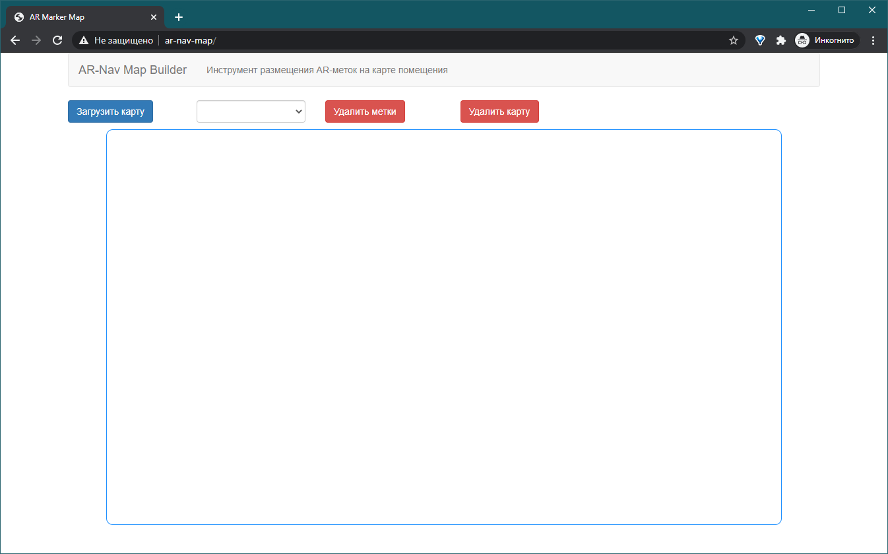
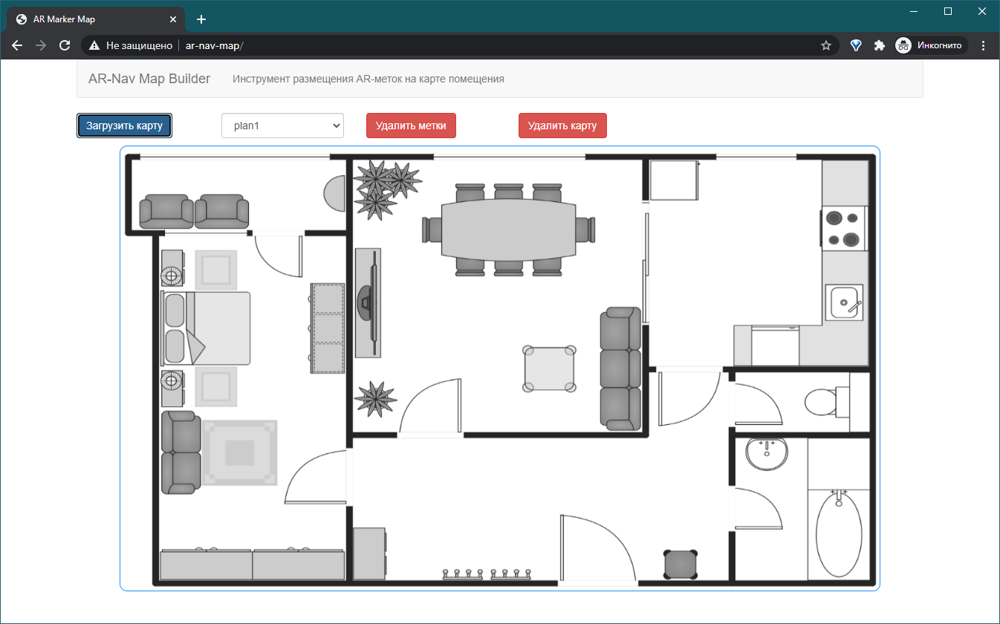
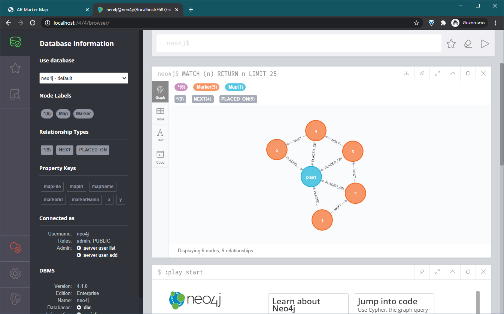

# AR-Nav Map Builder

Генератор данных для [AR-Nav](https://github.com/petrenko-alex/ar-nav).  
Позволяет загрузить карту помещения и расставить на ней метки.  
Данные сохраняются в графовую БД neo4j.  

Установка:
- ```npm i```
- ```composer install```
- создать и запустить БД neo4j.
- задать параметры подключения в js/index.js.





